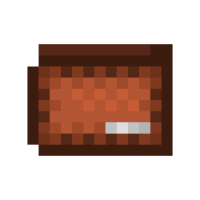

# Rupees-Economy

**Rupees-Economy** adds a unique currency system to Minecraft by introducing Rupees as an in-game currency. This project includes both a **Datapack** and a **Resourcepack**, allowing players to manage a survival-friendly economy system through Rupees. Players can use this system for trading, building economies, and much more. Admins have access to various functions to manage Rupees, and players can carry and trade Rupees using a special wallet.

## Features

### Rupees Datapack
- **Rupees as Currency**: Introduces Rupees into Minecraft, allowing players to manage transactions and trades using this new currency.
- **Currency Exchange**: With the **ATM Villager**, players can exchange Rupees of one type for Rupees of another type at a specified conversion rate.
- **Wallet System**: Players can store their Rupees in a special wallet. Admins also have access to prefilled wallets, which contain a specific number of Rupees.

### Rupees Resourcepack
- **Custom Textures**: Changes the appearance of Rupees in the game, giving each type of Rupee a unique texture to visually represent different values.
- **Icons for Rupees**: Each Rupee type has a distinct icon, making it easy to distinguish between them.

### Admin Functions
Admins have access to the following special commands:
1. **0adminmenu**: Opens an admin menu that allows admins to give specific amounts of Rupees of various types.
2. **Prefilled Wallet**: A wallet worth **700 Green Rupees**. This option is available via the admin menu. 
3. **1ofeachrupee**: Directly gives 1 of each Rupee type (Green, Orange, Blue, Red, Purple, Grey, Yellow, Gold, Black). This collection is worth **888 Green Rupees** in total. This option is available via the admin menu.
4. **atmvillager**: Spawns a special Villager that acts as an ATM for Rupee exchanges. Players can exchange a certain number of Rupees of one type and receive the appropriate amount of a different type. This option is available via the admin menu.

### Rupee Types & Values
There are various types of Rupees, each with a different value. The worth of each Rupee is as follows:

- **Green Rupee**: Worth 1 Green Rupee
- **Orange Rupee**: Worth 2 Green Rupees
- **Blue Rupee**: Worth 5 Green Rupees
- **Red Rupee**: Worth 10 Green Rupees
- **Purple Rupee**: Worth 20 Green Rupees
- **Grey Rupee**: Worth 50 Green Rupees
- **Yellow Rupee**: Worth 100 Green Rupees
- **Gold Rupee**: Worth 200 Green Rupees
- **Black Rupee**: Worth 500 Green Rupees

Additionally, there is a special item:

- **Wallet**: A special item that functions like a bundle, allowing players to store and carry Rupees. The wallet can hold multiple Rupees, and items can be added or removed as needed. It can be obtained through the admin menu.

  

## Installation

### 1. Download the Files
- Download the [Rupees Economy Datapack](#) and [Rupees Economy Resourcepack](#).

### 2. Install the Datapack

1. Navigate to your Minecraft world's `datapacks` folder. You can find it in the world directory: `world_name/datapacks`.
2. Place the **Rupees Economy Datapack** file here.
3. Open your Minecraft world and run the `/reload` command to load the datapack.

### 3. Install the Resourcepack

1. Download the **Rupees Economy Resourcepack**.
2. Move the Resourcepack file to your `resourcepacks` folder in Minecraft.
3. Go to **Options** > **Resource Packs** in Minecraft and select the **Rupees Economy Resourcepack**.

### 4. Start Using Rupees!

Once both the **Datapack** and **Resourcepack** are installed, you should be able to use Rupees in your Minecraft world!

## Admin Functions Explained

### 1. `0adminmenu`
- **What it does**: Opens an admin menu that allows admins to give Rupees of specific worths. Admins can choose the type and amount of Rupees they wish to give to players.
- **How to use**: 
    1. Ensure you are **OP** (administrator) in the Minecraft world.
    2. Run the command: `/function rupees:0adminmenu`.

### 2. `1ofeachrupee`
- **What it does**: Directly gives 1 of each Rupee type (Green, Orange, Blue, Red, Purple, Grey, Yellow, Gold, Black). The total worth of these Rupees is **888 Green Rupees**.
- **How to use**: 
    1. Ensure you are **OP** in the world.
    2. Open the **admin menu** by running the command `/function rupees:0adminmenu`, then select **1 of Each Rupee**.

### 3. `atmvillager`
- **What it does**: Spawns a Villager that acts as an **ATM**. Players can exchange one type of Rupee for another by interacting with this Villager. The Villager exchanges a set amount of one type of Rupee for the corresponding amount of another type.
- **How to use**: 
    1. Ensure you are **OP** in the world.
    2. Run the command: `/function rupees:atmvillager`.

### 4. Wallets 

- **Wallet**: A special item that can hold Rupees for the player. The wallet is available through the **admin menu**.
- **Prefilled Wallet**: A wallet worth **700 Green Rupees**. This option is available via the admin menu.
- **1 of Each Rupee**: A collection of 1 of each Rupee type, worth **888 Green Rupees** in total. This option is available via the admin menu.

## Compatibility

- **Minecraft Version:** This datapack and resourcepack are compatible with Minecraft 1.20 and earlier.
- **Not Compatible with Minecraft 1.21:** Currently, this setup does not work on Minecraft version 1.21.

## License

This project is licensed under the [MIT License](LICENSE).

Feel free to open an issue if you encounter any bugs or problems.

---

Happy trading with Rupees! Enjoy your new economy system in Minecraft!
